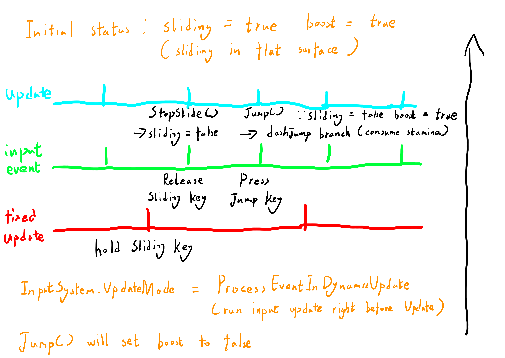
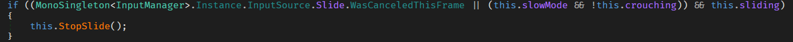
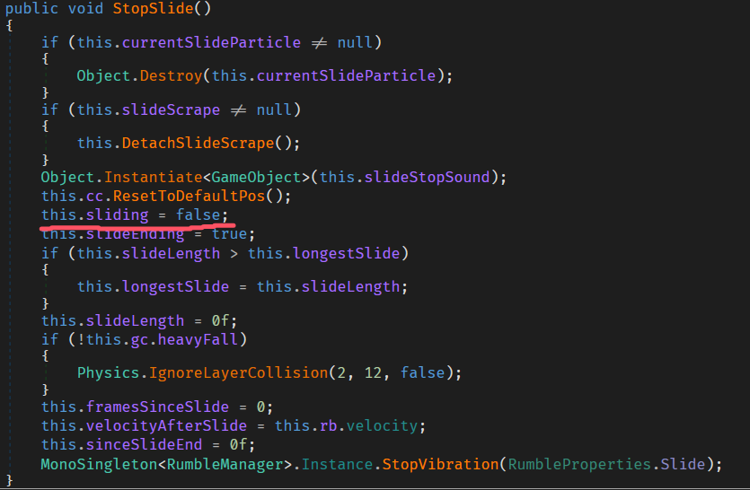
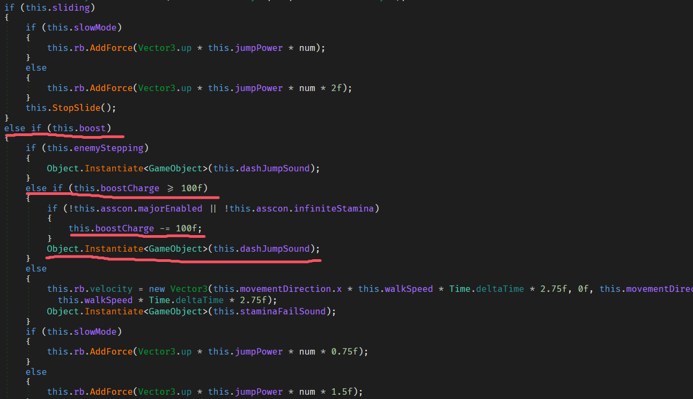

### 目前情况
当Jump触发时，sliding为false，boost为true

但是他妈的为什么

大概知道了，update太超模了运行多次没fixedupdate用dodge清理boost值，然后inputSystem检测到跳就直接爆了

### 项目本身
一些patch用于检测，一些patch用于debug

神秘扣体力跳可以按住滑铲然后射轨道炮来达成，但还是要roll随机

### 大纲：
操作：
按住滑铲，松开滑铲，按跳跃
#### 时间线：
根据视频与Unity官方文档，当前的输入与帧循环情况如下：

1. **FixedUpdate()**
   - Time.fixedDeltaTime 为 0.008，也就是8ms
   - 所以运行在125fps (1/0.008)

2. **Update()**
   - 每帧执行一次

3. **InputSystem**
   - ULTRAKILL的UpdateMode: `ProcessEventsInDynamicUpdate`
   - DynamicUpdate是每帧执行一次，在 **Update() 之前**处理输入事件

官方文档说明: 
- [Event function execution order](https://docs.unity3d.com/Manual/execution-order.html)
- [Input System Update Mode](https://docs.unity3d.com/Packages/com.unity.inputsystem@1.16/api/UnityEngine.InputSystem.InputSettings.UpdateMode.html#:~:text=In%20this%20mode%2C%20Update%20%28%29%20must%20be%20called,in%20the%20frame%20explicitly%20at%20an%20exact%20location.)

此操作唯二可以修改boost变量为false的地方：
- Jump()的最后面
- Dodge()的后面
其中 Dodge()只在FixedUpdate()里调用
#### 假说：
**触发方式**
- 在FixedUpdate()之后，一帧松掉滑铲键，一帧按跳跃，且两个操作要在两次FixedUpdate之间完成
也就是说理想情况下最大容错为8ms，最不理想情况下就是完全搓不出来 (第一帧没问题，但FixedUpdate在第二帧上)

**FixedUpdate()**
- 触发Dodge()，由于sliding为true所以不修改boost的值

**两次FixedUpdate的执行间隔里的多帧**
frame 1:
    - InputSystem : 检测到松开了slide键
    - Update() : 由于松开了slide键执行了StopSlide()，将sliding设置为false

frame 2:
    - InputSystem : 检测到按下了跳跃键
    - Update() ：执行了Jump()，由于boost为true触发了冲刺音效和扣体力值

由于SSJ要求boost为false所以触发不了SSJ

Fig.1：理想流程

   

Fig.2：在Update里的StopSlide分支

Fig.3：StopSlide函数

Fig.4: boost为true的分支

#### 避免方式
能有这个bug说明你的游戏帧率真的很高

#### 解决方式 (WIP)
我怎么知道啊，反正FixedUpdate和Update里必须统一一下哪段放哪段

#### 感谢
10_days_till_xmas

Alma